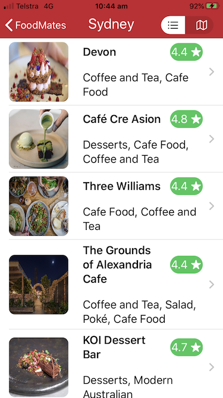

# FoodMates
A SwiftUI application for restaurant search based on user location and search functionality using Zomato API implementing MVVM design pattern and Combine framework. Get your Zomato API key from [here](https://developers.zomato.com/).

# Features
###### 1. Networking implementation using Combine framework.
###### 2. Asynchronous image loading from URL thanks to [Vadim Bulavin](https://www.vadimbulavin.com/asynchronous-swiftui-image-loading-from-url-with-combine-and-swift/)'s tutorial.
###### 3. User's current location fetch in background using Combine thanks to [this](https://stackoverflow.com/a/57690149/2552460) stackoverflow answer.
###### 4. Combine's ``` dropFirst ``` and ```debounce``` feature for search functionality.

```
    $city
        .dropFirst(1)
        .debounce(for: .seconds(0.5), scheduler: schedular)
        .sink(receiveValue: locationSearch(city:))
```
###### 5. MapView implementation in SwiftUI using ```UIViewRepresentable```


# Demo

### Screenshots




### Video


### Note: All image resources used from [FlatIcon](https://www.flaticon.com/) and [Unsplash](https://unsplash.com/)
